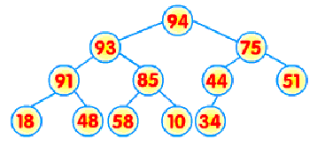

这个题目可以用来练习各种排序算法。

# 堆排序

不稳定的排序，时间复杂度：O (n logn)。

## 代码

```java
// 堆排序
class Solution {

    int[] nums;
    int size;
    final int NONE = -60000;

    public int[] sortArray(int[] nums) {
        this.nums = nums;
        this.size = nums.length;
        buildHeap();
        while (this.size > 1) {
            popTop();
        }
        return nums;
    }

    private void buildHeap() {
        for (int i = size / 2 - 1; i >= 0; i--) {
            heapify(i);
        }
    }

    private void heapify(int i) {
        int largest = i;
        int l = 2 * i + 1;
        int r = 2 * i + 2;
        if (l < size && nums[l] > nums[largest]) largest = l;
        if (r < size && nums[r] > nums[largest]) largest = r;
        if (largest != i) {
            swap(nums, i, largest);
            heapify(largest);
        }
    }

    private int popTop() {
        if (size <= 0) return NONE;
        int top = nums[0];
        swap(nums, 0, --size);
        heapify(0);
        return top;
    }

    // 这个题不会用到，但是也练习一下
    private int getTop() {
        if (size > 0) {
            return nums[0];
        }
        return NONE;
    }

    // 这个题不会用到，但是也练习一下
    private void insert(int num) {
        int i = size++;
        int parent = (i - 1) / 2;
        while (i > 0 && nums[parent] < num) {
            nums[i] = nums[parent];
            i = parent;
            parent = (i - 1) / 2;
        }
        nums[i] = num;
    }

    private void swap(int[] nums, int i, int j) {
        int tmp = nums[i];
        nums[i] = nums[j];
        nums[j] = tmp;
    }

}

```


## 堆（heap）的概念

特殊的完全二叉树，是一个从上到下有大小关系的二叉树（如父节点>=子节点 或者  父节点<=子节点）。其中，父节点值大于或等于其孩子节点值的，叫“最大堆（maximum heap)”;父节点值小于或等于孩子节点值的，叫“最小堆（minimum heap)”.




## 存储

一般都用数组来表示堆。

- length[A]：数组元素个数。
- heap_size[A]：存放在数组A中的堆的元素个数。

在起始索引为 0 的“堆”中：

1. 堆的根节点将存放在位置 0 
2. 节点 i 的左子节点在位置 2 * i + 1
3. 节点 i 的右子节点在位置 2 * i + 2
4.  节点 i 的父节点在位置 floor( (i - 1) / 2 ) 

在起始索引为 1 的“堆”中：

1. 堆的根节点将存放在位置 1
2. 节点 i 的左子节点在位置 2 * i
3. 节点 i 的右子节点在位置 2 * i + 1
4. 节点 i 的父节点在位置 floor( i / 2 ) 

以下的伪代码下标均从1开始。

遍历数组就相当于层次遍历堆。


## 堆化

数组具有对应的树表示形式。一般情况下，树并不满足堆的条件。通过重新排列元素，可以建立一棵“堆化”的树。


时间复杂度：O ( logn )

```txt
heapify(A, i)  //示例i节点最大堆化
    l ← left(i)      //左子节点
    r ← right(i)     //右子节点
    if l <= heap_size[A] and A[l] > A[i]
        then largest ← l
    else largest ← i
    if r <= heap_size[A] and A[r] > A[largest]
        then largest ← r
    if largest != i
        then exchange (A[i],A[largest])
        heapify(A,largest) //避免调整之后以largest为父节点的子树不是堆
```

## 建堆

建堆的过程是一个"从下到上"调整堆的过程。

时间复杂度：O (n logn)

```
Build-heap(A)  //建堆，起始索引1
    heap-size[A] ← length[A]
    for i ← floor(length[A] / 2) downto 1  // 从最后一个非子节点开始，到根节点
    	do heapify(A,i)
```

示例。


## 堆的操作

- max (S):返回S中具有最大关键字的元素。
- insert(S,x):将x插入S。
- extract-max(S):去掉最大，从余下的选出最优。

**max (S)**

时间复杂度：O(1)

```
HEAP-max (A)
	return A[1]           // O(1)
```

**insert(S,x)**

时间复杂度：O(logn)

```
HEAP-insert(A,key)  //将key插入最大堆A中
    heap-size[A] ← heap-size[A] + 1
    i ← heap-size[A]                                                   
    while i > 1 and A[parent(i)] < key
        do a[i] ← A[parent(i)]
           i ← parent(i)
    A[i] ← key
```

**extract-max(S)**

时间复杂度：O(logn)

```
HEAP-extract-max(A)
    if heap-size[A] < 1                                                   
    	then error “heap underflow”
    max ← A[1]
    A[1] ← A[heap - size[A]]  //最后一个元素放在第一
    heap-size[A] ← heap-size[A] - 1
    heapify(A, 1); 
    return max
```


## 堆排序思想

逐个输出

1. 将原始记录序列建成一个堆，称之为初始堆;
2. 输出堆顶元素, 调整剩余的记录序列，使之成为一个新堆，再输出堆顶元素；
3. 依此类推，当堆中只有一个元素时，整个序列的排序结束，输出的序列便是原始序列的排序序列。

原地排序

堆化之后，逐个弹出（弹出其实是把这个元素放在最后），完全弹出之后，原来的数组也是有序的。

大根堆升序、小根堆降序。


## 参考

课程PPT。


